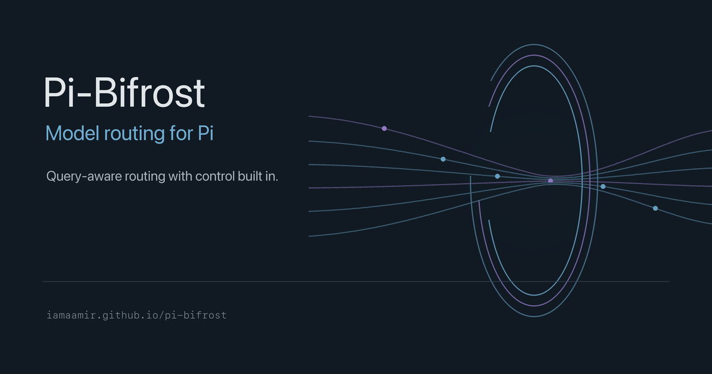

# Bifrost



Pi-Bifrost is **native model routing for [Pi](https://pi.dev)**. Before generation starts, it switches Pi's actual active model to one from your configuration.

```text
"summarize this file"         → your quick model
"debug this race condition"   → your frontier model
```

**Why it is different:**

- **Native model switch** — Pi uses selected provider/model for turn, not a virtual profile or prompt-side delegation.
- **Persistent circuit breaker** — repeated probe, activation, and stream failures survive restart; one half-open trial controls recovery.
- **No automatic replay** — Bifrost routes future prompts around uncertain failures. It never silently repeats edits, commands, or external side effects.
- **Inspectable control** — preview route, pin current model, or force a tier for one message.
- **Model-agnostic setup** — `/bifrost init` probes supported models available through Pi, then proposes tier lists without hardcoded maintainer model IDs.
- **Host-real verification** — unit tests, Pi TUI smoke tests, and fake-provider SSE E2E cover routing and reliability behavior.
- **Optional TypeSafe/Jev backend** — Jev selects a configured Bifrost tier; Bifrost retains model availability, reliability, fallback policy, and Pi model activation. See [`docs/jev-typesafe-architecture.md`](docs/jev-typesafe-architecture.md) before enabling it.

## Install

```bash
pi install npm:pi-bifrost
```

Or from source:

```bash
pi install git:github.com/iamaamir/pi-bifrost
```

## Setup

Run this once:

```
/bifrost init
```

It probes every model you have access to, finds the ones that actually work, and writes a config. Say yes when asked.

Done. Bifrost is now routing your prompts.

## Looking for fun ways to use Bifrost?

[Bifrost Patterns](https://github.com/iamaamir/bifrost-pattern) explores what happens after Bifrost picks a model for one turn:

- send scouts, implementers, and reviewers through different routes;
- turn repository onboarding into an evidence-backed walkthrough;
- compare configured models before proposing routing tiers;
- keep work local, inspectable, and replay-free.

Patterns is a playground on top of Bifrost, not required infrastructure.

## What it does

Bifrost first applies direct rules and recent classification-cache matches. If needed, regex rules or optional LLM classification choose a configured tier such as `quick`, `general`, or `frontier`. One policy then selects a matching Pi model by list order, cost, context window, or random choice. Pi switches before your prompt is sent.

You stay in control: run `/bifrost preview <prompt>` to inspect a decision, prefix one prompt with a tier name to force it, or use `/bifrost pin` after switching models manually.

If a model repeatedly fails (probe timeout, auth error, provider stream failure), Bifrost opens its circuit and routes future prompts to other candidates until cooldown and a recovery trial. It never reruns your failed prompt automatically.

## Commands

| Command | What it does |
|---------|-------------|
| `/bifrost` | Open mode/model dashboard and quick actions |
| `/bifrost init` | Probe models and generate config |
| `/bifrost probe` | Test which models actually respond |
| `/bifrost preview <prompt>` | See what would happen without sending |
| `/bifrost on` / `off` | Enable / disable routing |
| `/bifrost pin` / `unpin` | Lock current model / resume routing |
| `/bifrost reload` | Reload config after editing |
| `/bifrost cache stats` | Show classification cache |
| `/bifrost cache clear` | Clear classification cache |
| `/bifrost classifier` | Choose `prompt` or opt-in `typesafe`/Jev backend; TypeSafe requires project approval |
| `/bifrost classifier on` / `off` / `test` / `status` | Enable, disable, test, or inspect classifier; toggles persist to `.pi/bifrost-state.json` |

## UI smoke test

Run `npm run test:ui` to capture Pi TUI screenshots for startup, dashboard, preview, disabled, classify, and pinned states. Output lands in `screenshots/ui-smoke/`.

```bash
npm test                # unit tests
npm run test:integration  # integration tests
npm run test:ui         # Pi TUI smoke tests
npm run test:ui:reliability  # self-contained reliability E2E (fake provider)
npm run release         # publish release
```

UI backlog and priorities: [`docs/ui-enhancements.md`](docs/ui-enhancements.md).

## Config

Config is supported at multiple paths with this precedence (later wins):

1. Extension default (`<extensionDir>/bifrost.json`)
2. Global (`~/.pi/agent/bifrost.json`)
3. Project root (`bifrost.json`)
4. Project config (`.pi/bifrost.json`)

Editor autocomplete works in VS Code, Zed, Cursor.

### Tiers and models

The default config ships with three tiers. Run `/bifrost init` to populate them from your Pi registry, or edit the arrays manually.

```json
{
  "models": {
    "quick": [
      "opencode/deepseek-v4-flash-free",
      "opencode/mimo-v2.5-free"
    ],
    "general": [
      "opencode-go/deepseek-v4-pro",
      "opencode-go/glm-5.2",
      "openai-codex/gpt-5.4-mini"
    ],
    "frontier": [
      "openai-codex/gpt-5.6-sol",
      "opencode-go/glm-5.2",
      "opencode-go/deepseek-v4-pro"
    ]
  }
}
```

Each tier has a list of model patterns. `provider/id` for exact, or just `qwen` for substring match.

### Strategies

How Bifrost picks from the list. Set globally or per-tier:

| Strategy | Picks |
|----------|-------|
| `cheapest` | Lowest cost (input + output) |
| `cheapest_input` | Lowest input cost |
| `cheapest_output` | Lowest output cost |
| `largest_context` | Biggest context window |
| `random` | Random pick |
| `first` / `fastest` | First in list (init sorts by speed) |

```json
{
  "strategy": "first",
  "categoryStrategies": {
    "quick": "random",
    "general": "first",
    "frontier": "first"
  }
}
```

### Routing rules

Regex patterns that map prompts to tiers. First match wins. Case insensitive.

```json
{
  "rules": [
    {
      "pattern": "(^|\\s)\\/?commit(?:\\s|$)|\\b(commit message|conventional commit)\\b",
      "model": "quick"
    },
    {
      "pattern": "(^|\\s)\\/?format(?:\\s|$)|\\b(format this json|format this code)\\b",
      "model": "quick"
    },
    {
      "pattern": "(^|\\s)\\/?test(?:\\s|$)|\\b(unit tests?|integration tests?|e2e tests?)\\b",
      "model": "general"
    },
    {
      "pattern": "(^|\\s)\\/?debug(?:\\s|$)|\\b(stack trace|crash|memory leak|flaky test)\\b",
      "model": "frontier"
    },
    {
      "pattern": "(^|\\s)\\/?arch(?:\\s|$)|\\b(system architecture|api design|migration strategy)\\b",
      "model": "frontier"
    },
    {
      "pattern": "\\b(review this code|code review|audit this code)\\b",
      "model": "frontier"
    }
  ]
}
```

Rules can also live in a separate `.pi/bifrost-routes.json` file or a root-level `bifrost-routes.json` — `.pi/bifrost-routes.json` takes precedence.

### Direct model bindings

Instead of a tier name, use a model reference (`provider/id`) — the matched prompt routes directly to that exact model, bypassing tier selection entirely.

```json
{
  "rules": [
    {
      "pattern": "\\bcommit\\b",
      "model": "opencode-go/glm-5.1"
    },
    {
      "pattern": "\\btest\\b",
      "model": "opencode/deepseek-v4-flash-free"
    }
  ]
}
```

Useful for `/commit`, `/test`, `/explain` — any pattern where you want a specific model every time. The value must contain `/` to be treated as a direct reference.

### Inline override

Type a tier name as the first word to force that tier for one message. No config change needed.

```
frontier debug this race condition
quick summarize this
frontier implement the auth module
```

The tier name is stripped before routing — the rest goes to your prompt clean.

### Classifier

An LLM that reads your prompt and picks a tier. More accurate than regex, costs a few tokens. Uses a cheap model — you configure which one.

```json
{
  "classifier": {
    "enabled": true,
    "model": "opencode/mimo-v2.5-free"
  }
}
```

If classifier fails or is disabled, regex rules take over. Successful LLM classifier results enter local classification cache, so similar repeat prompts can skip another classifier call.

#### Optional TypeSafe/Jev backend

TypeSafe is disabled unless explicitly selected with `classifier.backend: "typesafe"`. It sends each cache-miss prompt to official `https://api.typesafe.ai/v1/systemone` using a `typesafe` API-key credential from Pi's `~/.pi/agent/auth.json` first, then `TYPESAFE_API_KEY`, pinned `classifier.typesafe.model: "jev-1.13.0"`, and default confidence gate `0.80`. Configure criteria for every tier. Keep existing `classifier.model` for optional prompt fallback:

```json
{
  "classifier": {
    "enabled": true,
    "backend": "typesafe",
    "model": "my-prompt-classifier",
    "typesafe": {
      "model": "jev-1.13.0"
    },
    "minConfidence": 0.8,
    "criteria": {
      "quick": "Bounded, reversible work",
      "general": "Normal implementation and moderate reasoning",
      "frontier": "Complex, ambiguous, or high-consequence work"
    }
  }
}
```

Low confidence, missing key, outage, circuit-open state, or invalid response falls back to existing prompt classifier, then regex/default. Requests reject redirects, retry only bounded transient failures, and never replay user turns. Prompt transmission and TypeSafe retention follow TypeSafe policy.

TypeSafe activation also requires exact project approval in the user-level Pi agent `bifrost.json`; project files cannot self-approve. Store credentials in Pi's auth file (recommended) or export the environment variable; never put API keys in project config:

```json
{
  "classifier": {
    "typesafe": {
      "trustedProjects": ["/absolute/path/to/project"]
    }
  }
}
```

Recommended credential setup in `~/.pi/agent/auth.json`:

```json
{
  "typesafe": {
    "type": "api_key",
    "key": "ts_..."
  }
}
```

Or use the shell environment:

```bash
export TYPESAFE_API_KEY="ts_..."
```

Run `/bifrost classifier test` to force a fresh nonce-bearing request and inspect backend activity. `/bifrost classifier status` shows `credential=auth-file`, `credential=environment`, or `credential=missing`; keys are never displayed. `/bifrost classifier` opens the backend picker in Pi's UI.

Bifrost's existing fuzzy cache persists normalized prompt text locally for 30 days by default (`cache.ttlHours`), then evicts expired entries; disable it for sensitive projects. TypeSafe operational observation is content-free and local: bounded aggregate outcomes, tiers, confidence bands, latency buckets, and attempt counts are stored in `.pi/bifrost-classifier-metrics.json` and shown by `/bifrost classifier status` and `/bifrost debug`. It never stores prompts, probabilities, or credentials. Set `classifier.typesafe.metrics.enabled` to `false` to disable this file.

For an end-to-end request trace, enable both global debug and TypeSafe debug:

```json
{
  "debug": { "enabled": true },
  "classifier": {
    "backend": "typesafe",
    "typesafe": { "debug": true }
  }
}
```

Trace events are written to `.pi/bifrost-debug.jsonl` and include request attempts, official endpoint, HTTP status, decoded tier, confidence, probabilities, retry/failure outcome, and correlation ID. This mode includes prompt/response classification data; use only for local troubleshooting and disable afterward. Credentials and authorization headers are never logged.

### Debug logging

```json
{
  "debug": { "enabled": true }
}
```

Writes `.pi/bifrost-debug.jsonl` — one JSON line per event with routing reason, selected tier/model, and timing. Normal Bifrost debug events do not store prompt bodies.

For TypeSafe's full local troubleshooting trace, also set `classifier.typesafe.debug: true`. This explicitly includes the prompt and provider classification response, plus request/response details. Never enable it in shared logs or production collection; disable it after troubleshooting. API keys and authorization headers are never logged.

### Full config reference

```json
{
  "$schema": "../pi-bifrost/schema.json",
  "enabled": true,
  "default": "general",
  "strategy": "first",
  "categoryStrategies": { "quick": "cheapest", "general": "first", "frontier": "first" },
  "models": { ... },
  "rules": [ ... ],
  "classifier": {
    "enabled": true,
    "model": "...",
    "method": "auto",
    "maxTokens": 20,
    "temperature": 0,
    "fallbackToRegex": true,
    "systemPrompt": "..."
  },
  "cache": {
    "enabled": true,
    "maxEntries": 500,
    "threshold": 0.85
  },
  "reliability": {
    "enabled": true,
    "failureThreshold": 3,
    "windowMinutes": 5,
    "cooldownMinutes": 60
  },
  "probe": {
    "concurrency": 50,
    "timeoutMs": 10000
  },
  "debug": { "enabled": false }
}
```

### Reliability: circuit breaker for flaky models

Tracks model health across probe results and runtime failures. Models that fail repeatedly are temporarily skipped (circuit open) and Bifrost falls back to the default tier.

```json
{
  "reliability": {
    "enabled": true,
    "failureThreshold": 3,
    "windowMinutes": 5,
    "cooldownMinutes": 60
  }
}
```

**How it works:**
- Records failures from probe timeouts, `setModel` auth errors, and provider stream errors
- Opens circuit after `failureThreshold` failures within `windowMinutes`
- Open-circuit models are excluded from routing; Bifrost falls back to default tier
- Circuit closes automatically after `cooldownMinutes` — next request attempts a trial
- Successful trial closes the circuit; repeated failure doubles cooldown
- State persists in `.pi/bifrost-reliability.json`
- Disabled reliability (`"enabled": false`) is a clean no-op — no tracking, no persistence

The dashboard shows open-circuit count in the title. `/bifrost preview` and `/bifrost debug` display skipped candidates with remaining cooldown.

See [`examples/economical-frontier-reliability.json`](examples/economical-frontier-reliability.json) for a complete config.

## Pin vs Enable

| Control | Persists | Survives restart | Inherits to subagents |
|---------|----------|-----------------|----------------------|
| `/bifrost on` / `off` | Yes (state file) | Yes | Yes — children inherit policy |
| `/bifrost pin` / `unpin` | No (session-local) | No | No — children always route |

**`enabled`** is a policy toggle. When routing is off, no model switching happens for anyone sharing that state. Subagents inherit it.

**`pinned`** is a session preference. It locks the current model for the active session only. It is not written to disk and does not propagate to children. Subagents start with `pinned: false` and route independently.

This means an orchestrator can pin a model for itself while its subagents still route through bifrost — each child picks the best model for its own task.

See [ADR 0015](docs/adr/0015-pinned-ephemeral.md) for the design rationale.

## FAQ

### What does Bifrost's local cache store?

Bifrost maintains a **local routing-classification cache**. After a successful LLM classification, it stores a normalized prompt and its selected tier. Similar future prompts can reuse that tier and skip the classifier call. It does not store model answers.

The project-local cache is `.pi/bifrost-cache.jsonl`. Entries contain lowercased, punctuation-stripped, sorted prompt words, selected tier, last-use timestamp, hit count, and a hashed classifier-semantics fingerprint. Default limit is 500 entries with 30-day retention; entries use exact matching first, then token-set similarity (default threshold `0.85`) and are evicted least-recently-used first. Use `/bifrost cache stats` to inspect it or `/bifrost cache clear` to remove it.

### Do I need multiple models?

No. One healthy configured model is enough to start. Multiple models and tiers let Bifrost choose different candidates for routine, general, and demanding work. `/bifrost init` shows its proposed configuration before it writes anything.

### Does Bifrost cache assistant responses, tool output, or prompts for replay?

No. Repository state, tool output, and user intent can change even when prompt text is similar. Bifrost does not reuse old assistant responses or automatically replay a failed prompt; that could repeat edits, commands, or external side effects.

### What about provider prompt caching?

Provider prompt/prefix caching is managed by Pi and each model provider. Bifrost does not claim a universal prompt-cache implementation. It routes before the turn; providers decide whether a request qualifies for their own caching and billing behavior.

### What is stored locally, and can I disable it?

Classification-cache entries contain normalized prompt words, chosen tier, last-use timestamp, and hit count. Normalized prompts can still contain sensitive terms, so disable it for sensitive projects or move it with `cache.path`:

```json
{
  "cache": {
    "enabled": false
  }
}
```

Clear the cache after substantial tier/rule changes if you want every prompt classified fresh.

### What happens if a model fails?

Bifrost records probe, activation, and settled stream failures in `.pi/bifrost-reliability.json`. After repeated failures, it opens that model's circuit and routes future prompts to healthy candidates. After cooldown, exactly one half-open trial can prove recovery. Bifrost does not silently rerun the failed prompt.

Every field is optional. Config merges from: extension default → global (`~/.pi/agent/bifrost.json`) → project root (`bifrost.json`) → project config (`.pi/bifrost.json`).
