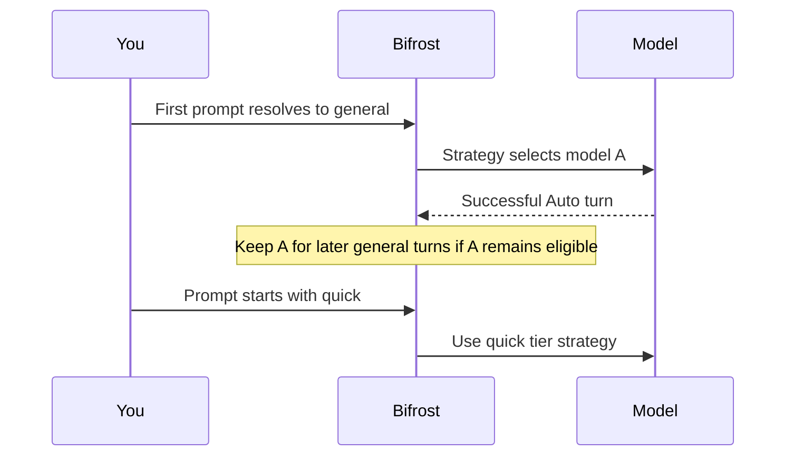

# Pi-Bifrost

[Getting started](docs/guide/getting-started.md) · [Configuration](docs/guide/configuration.md) · [Classifier backends](docs/guide/classifiers.md) · [Troubleshooting](docs/guide/troubleshooting.md) · [Examples](examples/README.md) · [Development](DEVELOPMENT.md)


## What Bifrost does

Pi-Bifrost chooses a suitable model for each message from the models you allow. You spend less time selecting and switching models by hand.

A tier is a named model group, such as `quick` or `general`. A classifier is an extra AI call that chooses a tier. It cannot choose a model outside your lists.

## Install

Connect and sign in to a model provider in Pi before you install Bifrost.

```bash
pi install npm:pi-bifrost
```

Fresh installs route by default. Before Pi sends your message, Bifrost chooses the active model in Pi.

If no user configuration or project route file exists, Bifrost builds temporary model lists from Pi's list for your first prompt. You can send a message without `/bifrost init`. A nonempty partial user configuration blocks this setup. An empty `{}` configuration file does not. Saved settings can change routing. See [Getting started](docs/guide/getting-started.md).

Select `bifrost/auto` in Pi's `/model` picker to let Bifrost choose which model answers each message. The footer shows Auto and the selected model. Use `/bifrost inspect` or `/bifrost debug` to see model lists and status without a classifier call. Pi's list does not prove a model will work.


```mermaid
sequenceDiagram
    participant You
    participant Bifrost
    participant Model
    You->>Bifrost: First prompt resolves to general
    Bifrost->>Model: Strategy selects model A
    Model-->>Bifrost: Successful Auto turn
    Note over Bifrost: Keep A for later general turns if A remains eligible
    You->>Bifrost: Prompt starts with quick
    Bifrost->>Model: Use quick tier strategy
```

Run `/bifrost init` to refresh Pi's model list or save starter lists. It asks once before saving, but its summary does not list every model ID or how Bifrost chooses among models. Review or edit the saved configuration before sending a message. Pass `-f` to send model test requests. These requests can use credits or reach usage limits.

By default, Auto can keep a successful model for later messages in the same tier while it remains allowed. A different tier uses its own model selection rule. See [Auto routing](docs/guide/auto-routing.md).

## Configure tiers

Edit your existing configuration to keep its model lists and settings. If you have no configuration, init can save starter lists first.

```json
{
  "default": "general",
  "models": {
    "quick": ["provider/fast-model"],
    "general": ["provider/general-model"],
    "frontier": ["provider/frontier-model"]
  }
}
```

Replace the example IDs with models available in Pi. The [configuration guide](docs/guide/configuration.md) explains strategies, rules, reserves, billing preferences, and fallback tiers.

## Inspect and control routes

Use these commands in Pi:

| Command | Result |
| --- | --- |
| `/bifrost preview <prompt>` | Show a route before a model answers. A classifier can receive the prompt. |
| `quick <message>` | Use the `quick` tier once. Bifrost removes its name before sending the prompt. |
| `/bifrost pin` / `/bifrost unpin` | Keep the model or resume routing. |
| `/bifrost off` / `/bifrost on` | Stop or resume routing. |
| `/bifrost classifier off` | Stop the extra AI call that chooses a tier. |
| `/bifrost cache stats` / `/bifrost cache clear` | View or empty saved entries. |

See [all commands](docs/guide/commands.md) and [routing controls](docs/guide/routing-controls.md).

## Privacy and reliability

The classifier is on by default. The local cache saves earlier routing decisions. It stores simplified words from prompts and the chosen tier. Treat these as sensitive. Bifrost does not cache answers. If the cache has no matching decision, the classifier can receive the prompt.

`/bifrost classifier off` stops this call and works without a Bifrost configuration file. Pi still sends the prompt to your selected model service.

To stop using the local cache, add `"cache": { "enabled": false }` inside your existing configuration. Keep its model lists. This stops cache lookups and new classification entries. It does not clear saved entries. `/bifrost cache clear` empties them. If you have no configuration, run `/bifrost init` first. See [reliability and local cache](docs/guide/reliability-and-cache.md).

If a model stops because you reach its usage limit, Auto can try another allowed model once. This is permitted only before the model produces output or uses tools. Pi must also safely remove the empty failed attempt. Otherwise Bifrost stops. See [Auto routing](docs/guide/auto-routing.md#recover-from-one-empty-allowance-failure) for the full limits.

Bifrost saves model failures locally and can stop using a model for a time. Bifrost does not fetch live usage limits from model services. See the [reliability guide](docs/guide/reliability-and-cache.md) and its [migration steps](docs/guide/reliability-and-cache.md#existing-users-migrate-reliability-state). Model changes can reduce prompt-cache reuse. Providers control cache use and billing. See [provider prompt caching](docs/guide/prompt-caching.md).

Set `reliability.retryOnAllowanceExhausted` to `false` to turn off the one Auto retry described above.

## Advanced

[Bifrost Patterns](https://github.com/iamaamir/bifrost-pattern) · [Experimental resolve-only router API for Node.js](docs/router-api.md).

## License

[MIT](https://opensource.org/license/mit)
