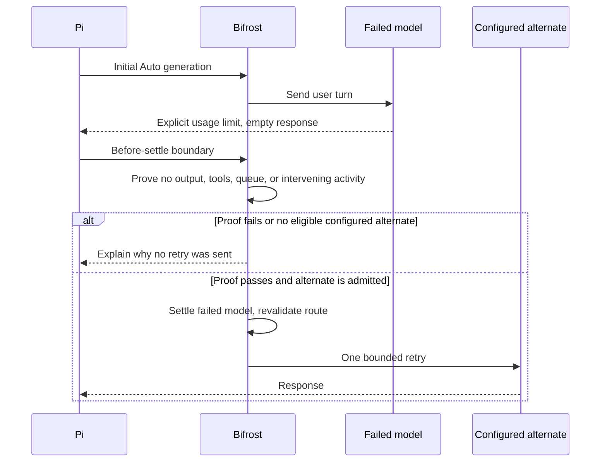
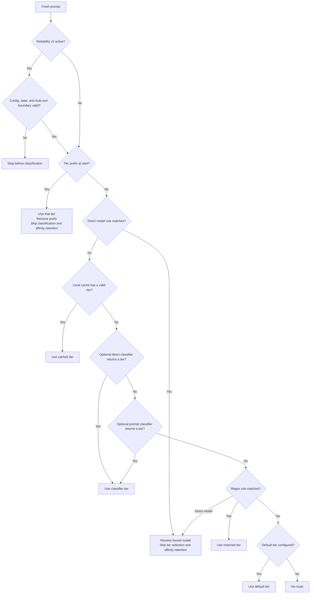
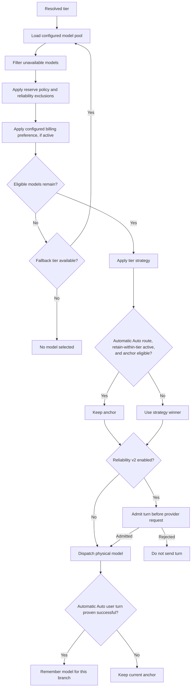

# Pi-Bifrost


**Route Pi turns through models you choose.** Pi-Bifrost is a model-routing extension for [Pi](https://pi.dev). You put models in named tiers and choose how each tier selects a model. Bifrost resolves a tier for each turn, skips models with open reliability circuits, and sends the turn to a configured model. It can make one visible allowance-recovery attempt in Auto when Pi proves the failed generation had no side effects. No proxy or hidden model pool.

```text
You:   quick fix the flaky test
       └─ explicit tier: quick
          └─ your quick pool → healthy candidate → your strategy
             └─ Pi runs provider/fast-model
```

The model above is an example, not a shipped default. Your configuration supplies the actual provider and model IDs. A classifier can suggest a **tier**, but it cannot choose a model outside your pool.

## Start in Pi

Requires Pi `1.0.1` or newer and at least one authenticated provider model available in Pi.

```bash
pi install npm:pi-bifrost
```

Then, inside Pi:

```text
/bifrost init
```

Init checks models available through Pi, proposes `quick`, `general`, and `frontier` pools, and writes `.pi/bifrost.json` after you confirm. It reuses recent probe results or sends small requests to available models. Those requests can consume provider credits or hit rate limits. [Review the init steps and probe limits](docs/guide/getting-started.md) before confirming.

After init, run `/bifrost classifier` to choose how Bifrost judges tiers. Use `/bifrost classifier off` for rules and the default tier without a classifier call.

## One policy, two ways to run it

**Physical selection is the default.** Bifrost selects Pi's active provider/model before generation. Pi shows the actual model for the turn. You can also select a physical model yourself to pin it for the session.

**Bifrost Auto is opt-in.** Select `bifrost/auto` in Pi's `/model` picker. Pi then dispatches the physical model for each request using the same tiers, reliability state, and selection strategies. The footer shows `bifrost/auto → provider/model`, and assistant messages record the physical model that answered. Pi-owned tool continuations stay on the model that started the turn. Pi may first make its own bounded retry; Bifrost's separate allowance recovery is described below. Auto requires Pi `1.0.1` or newer.

With legacy reliability settings, both modes use the same tier policy. Experimental `schemaVersion: 2` plus `reliability.stateVersion: 2` enables receipt-owned reliability for Auto user turns only. It requires a prepared v2 sidecar and fails closed before classification or generation when that state is missing or invalid. Physical routing and direct utility requests are unsupported while v2 is enabled; use `stateVersion: 1` for physical routing. `/bifrost pin` and `/bifrost off` remain available to leave Auto without sending a turn. Neither mode asks a model to follow routing instructions. [Read the routing controls](docs/guide/routing-controls.md) and [reliability guide](docs/guide/reliability-and-cache.md).

## How a route is chosen

```text
prompt → tier → your model pool → reliability filter → your strategy → Pi model
```

A tier is a named group such as `quick`, `general`, or `frontier`. Bifrost finds one through a tier name at the start of the message, a rule, its local classification cache, an optional classifier, or your default tier. A rule can also name an exact `provider/id` instead of a tier.

The pool limits which models qualify. The strategy selects a healthy candidate by list order, price, context window, probe-sorted speed, or random choice. Repeated failures open a persistent circuit so later turns avoid that model until a controlled recovery trial. A usage-allowance failure may trigger the bounded Auto recovery below.

### Allowance recovery in Auto

By default, Bifrost can retry once on a different model from your configured pools when a provider reports an explicit usage limit. Pi must prove the failed initial Auto response had no assistant content, tool calls, tool results, queued work, or intervening activity. The failed response is omitted from the next model request, while the original transcript remains visible. Bifrost settles the failed model before selecting and admitting the alternate. The selection and retry are shown in the terminal.

This recovery requires reliability to be enabled and `cooldownOnAllowanceExhausted` to remain enabled. Bifrost must save the failed model's cooldown before it can safely choose an alternate. Setting `retryOnAllowanceExhausted: false` turns off only this automatic retry.

The retry does not run for physical selection, direct model bindings, explicit tier prefixes, exhausted explicit fallback boundaries, tool continuations, unsafe/unknown turns, or when no configured model passes normal eligibility checks. A Pi-owned retry may precede Bifrost recovery only when each prior attempt was an empty error from the same model and Pi recorded its exact null context omission. If the selected tier has no eligible alternate and has no explicit fallback policy, Bifrost checks the configured default and remaining configured tiers in stable config order. Bifrost never infers provider-wide quota health. It sends no extra classifier or probe request and does not resubmit the user's prompt through `sendUserMessage`.

Disable the behavior in `.pi/bifrost.json` when you want every failed turn to stop:

```json
{
  "reliability": {
    "retryOnAllowanceExhausted": false
  }
}
```

See [ADR 0023](docs/adr/0023-bounded-allowance-recovery.md) for the exact boundary and tests.


```mermaid
sequenceDiagram
    participant Pi
    participant Bifrost
    participant Failed as Failed model
    participant Alternate as Configured alternate

    Pi->>Bifrost: Initial Auto generation
    Bifrost->>Failed: Send user turn
    Failed-->>Pi: Explicit usage limit, empty response
    Pi->>Bifrost: Before-settle boundary
    Bifrost->>Bifrost: Prove no output, tools, queue, or intervening activity
    alt Proof fails or no eligible configured alternate
        Bifrost-->>Pi: Explain why no retry was sent
    else Proof passes and alternate is admitted
        Bifrost->>Bifrost: Settle failed model, revalidate route
        Bifrost->>Alternate: One bounded retry
        Alternate-->>Pi: Response
    end
```

Legacy configurations may fall back to the configured default tier when a requested tier has no eligible model. Schema version 2 can set an explicit ordered `tierPolicies.<tier>.fallbackTiers` list; an empty list makes that tier a singleton boundary. Version 2 alone preserves legacy fallback behavior. See the [configuration guide](docs/guide/configuration.md#explicit-fallback-boundaries-schema-version-2).

### Routing a fresh prompt

These diagrams assume that Bifrost routing is enabled, no model is pinned, and each prompt starts a fresh user turn. Affinity retention and reliability v2 apply only to Auto. Retries and continuations stay on the model that started the turn.

An explicit tier prefix chooses a tier before classification. A direct model rule also skips tier selection. Otherwise, Bifrost checks its local classification cache, then uses configured classifiers, regex rules, or the default tier.


```mermaid
flowchart TD
    A["Fresh prompt"] --> B{"Reliability v2 active?"}
    B -- Yes --> C{"Config, state, and Auto turn boundary valid?"}
    C -- No --> D["Stop before classification"]
    C -- Yes --> E{"Tier prefix at start?"}
    B -- No --> E
    E -- Yes --> F["Use that tier<br/>Remove prefix<br/>Skip classification and affinity retention"]
    E -- No --> G{"Direct model rule matches?"}
    G -- Yes --> H["Resolve bound model<br/>Skip tier selection and affinity retention"]
    G -- No --> I{"Local cache has a valid tier?"}
    I -- Yes --> J["Use cached tier"]
    I -- No --> K{"Optional direct classifier returns a tier?"}
    K -- Yes --> L["Use classifier tier"]
    K -- No --> M{"Optional prompt classifier returns a tier?"}
    M -- Yes --> L
    M -- No --> N{"Regex rule matches?"}
    N -- Tier --> O["Use matched tier"]
    N -- Direct model --> H
    N -- No --> P{"Default tier configured?"}
    P -- Yes --> Q["Use default tier"]
    P -- No --> R["No route"]
```

The direct classifier and prompt classifier stages run only when configured. If a classifier does not return a valid tier, Bifrost continues to the next stage. A cache miss continues classification. It does not change a tier by itself. When reliability v2 is enabled, Bifrost checks its configuration, state, and Auto turn boundary before classification. It admits the selected model later, before the provider request.

### Selecting and dispatching a model

The anchor is the model from the last provably successful automatic Auto turn on this branch. Bifrost filters the configured pool before it applies the tier strategy. If that tier has no eligible model, its configured fallback tiers can be checked. Auto keeps the anchor only when retention is active and the anchor remains in the final selection pool.


```mermaid
flowchart TD
    A["Resolved tier"] --> B["Load configured model pool"]
    B --> C["Filter unavailable models"]
    C --> D["Apply reserve policy and reliability exclusions"]
    D --> E["Apply configured billing preference, if active"]
    E --> F{"Eligible models remain?"}
    F -- No --> G{"Fallback tier available?"}
    G -- Yes --> B
    G -- No --> H["No model selected"]
    F -- Yes --> I["Apply tier strategy"]
    I --> J{"Automatic Auto route, retain-within-tier active,<br/>and anchor eligible?"}
    J -- Yes --> K["Keep anchor"]
    J -- No --> L["Use strategy winner"]
    K --> M{"Reliability v2 enabled?"}
    L --> M
    M -- Yes --> N["Admit turn before provider request"]
    M -- No --> O["Dispatch physical model"]
    N -- Rejected --> P["Do not send turn"]
    N -- Admitted --> O
    O --> Q{"Automatic Auto user turn proven successful?"}
    Q -- Yes --> R["Remember model for this branch"]
    Q -- No --> S["Keep current anchor"]
```

Reliability v2 is active when schema version 2 sets `reliability.stateVersion: 2` and reliability is enabled. It requires valid state and a proven Auto turn before classification. It admits the selected model before Auto sends the provider request. Rejection stops the turn. The same one-attempt allowance-recovery exception applies after confirmed receipt settlement.

Auto affinity keeps a model within the selected tier. It does not keep related prompts in the same tier. A tier change can select a different model. Physical routing has affinity off by default. Schema version 2 can set `affinity.mode` to `off`, `observe`, or `retain-within-tier`.

```mermaid
sequenceDiagram
    participant You
    participant Bifrost
    participant Models

    You->>Bifrost: First ordinary prompt
    Note over Bifrost: Tier general<br/>Strategy selects A
    Bifrost->>Models: Dispatch A
    Models-->>Bifrost: Successful automatic Auto turn proven
    Note over Bifrost: Remember A for this branch

    You->>Bifrost: Follow-up prompt
    Note over Bifrost: Same tier; A and B eligible<br/>Keep A even if strategy selects B
    Bifrost->>Models: Dispatch A

    You->>Bifrost: Prompt with the quick prefix
    Note over Bifrost: Prefix selects quick<br/>Use its strategy; do not promote anchor
    Bifrost->>Models: Dispatch quick-tier winner

    You->>Bifrost: Later ordinary prompt for frontier
    Note over Bifrost: Tier changes to frontier<br/>Select from its eligible pool
    Bifrost->>Models: Dispatch frontier-tier winner
```

Start a message with a configured tier name to choose it for one turn:

```text
frontier review this authorization flow
```

Bifrost removes `frontier` before the model receives the message. If you pin a model, Bifrost leaves the message unchanged. Tier names used this way must be single lowercase alphabetic words in your configuration.

## A small configuration

Create `.pi/bifrost.json` in your project, or let `/bifrost init` propose one:

```json
{
  "default": "general",
  "strategy": "first",
  "models": {
    "quick": ["provider/fast-model", "provider/backup-fast"],
    "general": ["provider/general-model"],
    "frontier": ["provider/frontier-model"]
  },
  "categoryStrategies": {
    "quick": "first",
    "general": "first",
    "frontier": "largest_context"
  }
}
```

Replace the example IDs with models configured in Pi. The built-in default has empty model pools, not maintainer-chosen providers. `init` proposes pools from your available models. [Configure tiers, rules, and strategies](docs/guide/configuration.md).

## Stay in control

| In Pi | Result |
| --- | --- |
| `/bifrost preview [--trace] [--json] <prompt>` | Inspect a route without generating or activating its model. `--json` keeps the existing report; `--trace` adds a content-free decision summary, optionally as versioned JSON. An enabled classifier can still receive the preview prompt. |
| `quick <message>` | Use the configured `quick` tier for this message only. |
| Select a physical model or run `/bifrost pin` | Keep that exact model for the session. |
| `/bifrost unpin` | Resume routing each message. |
| `/bifrost off` / `/bifrost on` | Stop or resume routing. |
| `/bifrost classifier test` | Make a fresh tier-classification request and inspect its outcome. |

If you run `/bifrost pin` or `/bifrost off` while Auto is selected, Bifrost exits Auto. It uses the last dispatched physical model, or resolves your default tier if no model has dispatched yet. [See all commands](docs/guide/commands.md).

## Classification is optional

A classifier only judges which configured tier fits a prompt. Bifrost still owns candidate eligibility, reliability filtering, and model selection.

- **Prompt:** Ask a configured Pi chat model for a tier.
- **TypeSafe/Jev:** Call the direct TypeSafe classifier. Requires a TypeSafe credential.
- **Pi-native:** Use Pi's `classify()` API and its classifier catalog. This option appears only when Pi supports classification.

Set `classifier.backend` to keep a fixed choice. If you leave it unset, Bifrost detects Pi-managed TypeSafe credentials first, then `TYPESAFE_API_KEY`; otherwise it uses the prompt backend. The first routed request reports the detected backend and reason. Init can propose an enabled prompt classifier, so review the proposal before confirming. Disable classification for rules/default-only routing.

Optional classifiers receive the current prompt and tier criteria, not your provider model pool. Preview can make a classifier request. Confidence is not proof that a tier is correct. [Compare backends, credentials, privacy, and fallback](docs/guide/classifiers.md).

## When to keep one model

Pin an exact model when your session depends on one provider's context or prompt cache, or when you already know which model you want. Switching models can fragment provider prompt-cache locality. Returning to a model can reuse a valid prefix, but new conversation content may not be cached. Bifrost does not promise better code, lower cost, lower latency, or cache savings. [Read the model-switching cache guide](docs/guide/prompt-caching.md).

Bifrost stores normalized prompt terms and selected tiers in its local classification cache, not model answers. Treat those terms as potentially sensitive. Reliability state persists locally across restarts. Circuits help avoid observed failures on **future** turns; they do not enforce provider quota or replay the failed turn. [Read about reliability and the local cache](docs/guide/reliability-and-cache.md).

### Optional reserve observations

Schema version 2 can hold user-entered economic facts under `economics`. It is off when that namespace is absent. Start with `mode: "observe"` to see reserve and billing-preference effects without changing selection or random ordering. In `mode: "policy"`, configured reserves filter candidates, and optional `preference.billingClass` selects the existing strategy's pool from fresh preferred-class candidates in the chosen tier. Unknown or conflicting billing evidence stays neutral. Only local model/provider scopes and static `declared` or `estimated` sources are supported. Bifrost does not query billing APIs, infer account identity, guarantee a spend cap, or claim savings. Routing decision summaries expose billing class, source, authority, and freshness without allowance values. See [`economic-reserve-observe.json`](examples/economic-reserve-observe.json), [`economic-billing-preference.json`](examples/economic-billing-preference.json), and the [configuration guide](docs/guide/configuration.md#economic-observations-and-billing-preference-schema-version-2).

In the Pi extension, Auto retains a proven successful model within the selected tier by default. Physical routing stays off by default. Add `schemaVersion: 2` with `affinity.mode` to override this: `off` disables Auto retention, `observe` reports the anchor without changing selection, and `retain-within-tier` explicitly requests retention. The resolve-only API remains off when affinity is omitted. Retention only uses a model in the selected tier's final selection pool; billing preference can remove a model from that pool without making it a hard reserve or circuit exclusion. It never crosses tiers or restores a hard-excluded model. Physical routing is blocked before provider activity when explicit retention is configured; manual pin/off controls remain available. In Auto routing, explicit tier/model, direct, retry, and continuation outcomes do not retain the anchor. `/bifrost inspect` and `/bifrost preview --trace` show the effective mode and source. Affinity makes no cache or savings claim.

## Guides

[Getting started](docs/guide/getting-started.md) · [Routing controls](docs/guide/routing-controls.md) · [Configuration](docs/guide/configuration.md) · [Classifier backends](docs/guide/classifiers.md) · [Commands](docs/guide/commands.md) · [Troubleshooting](docs/guide/troubleshooting.md) · [Examples](examples/README.md)

[Bifrost Patterns](https://github.com/iamaamir/bifrost-pattern) explores optional multi-agent workflows outside Bifrost's router.

See the [experimental resolve-only router API](docs/router-api.md) for Node.js consumers.

## Development

```bash
npm test
npm run typecheck
npm run test:integration
npm run test:ui
npm run test:ui:reliability
```

## License

[MIT](https://opensource.org/license/mit)
