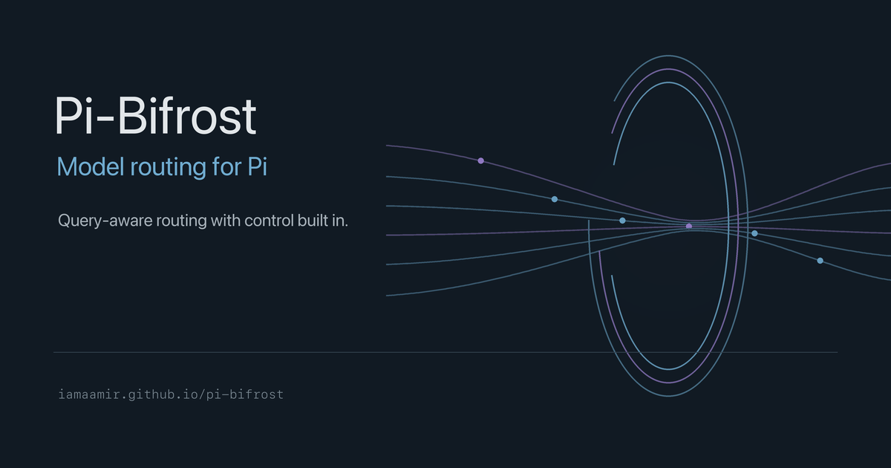
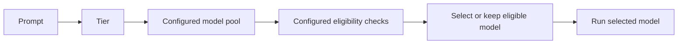
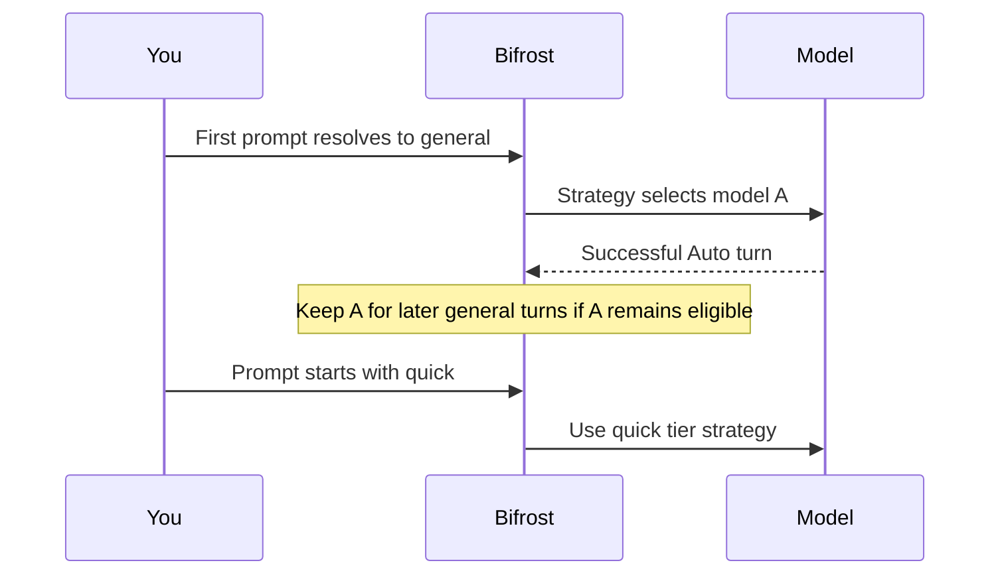

# Pi-Bifrost



Pi-Bifrost routes [Pi](https://pi.dev) turns through models you choose. A tier is a named group of models. You set its model pool and selection strategy. For tier-based routes, Bifrost picks a tier, checks model eligibility, then selects a model.


```mermaid
flowchart LR
    P[Prompt] --> T[Tier]
    T --> M[Configured model pool]
    M --> R[Configured eligibility checks]
    R --> S[Select or keep eligible model]
    S --> A[Run selected model]
```

A classifier can choose a tier. It cannot choose a model outside your configured pools. Bifrost uses Pi's provider connections.

## Install

Requires Pi `1.0.1` or newer and an authenticated provider model in Pi.

```bash
pi install npm:pi-bifrost
```

In Pi, run:

```text
/bifrost init
```

Init proposes model pools and shows the configuration before it writes `.pi/bifrost.json`. It can send small probe requests to available models. Those requests can use provider credits or hit rate limits. Review the [init steps and probe limits](docs/guide/getting-started.md) before you confirm.

After init, run `/bifrost classifier` to choose a classifier. Run `/bifrost classifier off` to use rules and the default tier without a classifier call.

## Routing modes

Auto is opt-in. Select `bifrost/auto` in Pi's `/model` picker to dispatch a physical model for each request. Pi's footer shows the Auto selection and the physical model for the request. Bifrost keeps a proven successful model for later turns in the same tier if it remains eligible. A tier change can select another model. Read the [Auto routing and model selection guide](docs/guide/auto-routing.md) for the selection steps and recovery rules.

Physical selection before generation remains the default. Bifrost selects Pi's active provider/model before generation. Select a physical model yourself to keep it active for the session.


```mermaid
sequenceDiagram
    participant You
    participant Bifrost
    participant Model
    You->>Bifrost: First prompt resolves to general
    Bifrost->>Model: Strategy selects model A
    Model-->>Bifrost: Successful Auto turn
    Note over Bifrost: Keep A for later general turns if A remains eligible
    You->>Bifrost: Prompt starts with quick
    Bifrost->>Model: Use quick tier strategy
```

Bifrost can make one visible allowance-recovery attempt in Auto after an explicit usage-limit error. It retries only if Pi proves every failed attempt was empty, came from the same model, and was omitted exactly from the next request. The turn must have no tools, tool results, queued work, or other activity. Other failures stop. Set `reliability.retryOnAllowanceExhausted` to `false` to turn off this retry. See [the reliability guide](docs/guide/reliability-and-cache.md) for details.

## Configure tiers

A strategy picks one eligible model from the tier. Start with `.pi/bifrost.json` or let init propose it:

```json
{
  "default": "general",
  "strategy": "first",
  "models": {
    "quick": ["provider/fast-model", "provider/backup-fast"],
    "general": ["provider/general-model"],
    "frontier": ["provider/frontier-model"]
  },
  "categoryStrategies": {
    "quick": "first",
    "general": "first",
    "frontier": "largest_context"
  }
}
```

Replace the example IDs with models available in Pi. Strategies include `first`, `cheapest`, `cheapest_input`, `cheapest_output`, `largest_context`, `fastest`, and `random`. `fastest` uses the current list order. It does not measure live latency.

The [configuration guide](docs/guide/configuration.md) covers rules and direct model bindings. Schema version 2 can set fallback tiers. An empty fallback list stops when the requested tier is exhausted. The guide also covers [reserves and billing preferences](docs/guide/configuration.md#economic-observations-and-billing-preference-schema-version-2). [Reconciliation](docs/guide/commands.md#reconcile-generated-model-membership) updates generated model pool entries.

## Inspect and control routes

Use these commands in Pi:

| Command | Result |
| --- | --- |
| `/bifrost preview <prompt>` | Show the proposed route without starting generation. An enabled classifier can receive the prompt. |
| `quick <message>` | Use the configured `quick` tier for one message. Bifrost removes the tier name before sending the rest. |
| `/bifrost pin` | Keep the current model for the session. |
| `/bifrost unpin` | Resume per-message routing. |
| `/bifrost off` and `/bifrost on` | Stop or resume routing. |
| `/bifrost classifier off` | Route with rules and the default tier. |
| `/bifrost cache stats` and `/bifrost cache clear` | Inspect or clear Bifrost's local classification cache. |

See [all commands](docs/guide/commands.md) and [routing controls](docs/guide/routing-controls.md).

## Privacy and reliability

An enabled classifier receives the current prompt and tier criteria. The local classification cache stores normalized prompt terms and selected tiers. Treat these terms as potentially sensitive. Bifrost does not cache model answers. You can disable the cache in `.pi/bifrost.json`:

```json
{
  "cache": { "enabled": false }
}
```

Reliability state persists locally. Circuits affect model eligibility on later turns. Auto allowance recovery follows the limited rule above. Circuits do not enforce provider-wide quota. See [reliability and local cache](docs/guide/reliability-and-cache.md).

Existing users who migrate reliability state can follow the [migration guide](docs/guide/reliability-and-cache.md#existing-users-migrate-reliability-state).

Switching models can reduce chances of reusing a provider's prompt cache. Pin a model when you want one model to handle a long session. Providers control cache use and billing, so reuse and savings are not guaranteed. See the [prompt-cache guide](docs/guide/prompt-caching.md).

## Guides

[Getting started](docs/guide/getting-started.md) · [Configuration](docs/guide/configuration.md) · [Classifier backends](docs/guide/classifiers.md) · [Troubleshooting](docs/guide/troubleshooting.md) · [Examples](examples/README.md)

The [Bifrost Patterns project](https://github.com/iamaamir/bifrost-pattern) covers optional multi-agent workflows outside Bifrost's router. The [resolve-only router API](docs/router-api.md) is experimental. It is intended for Node.js users.

## Development

```bash
npm test
npm run typecheck
npm run test:integration
npm run test:ui
npm run test:ui:reliability
```

## License

[MIT](https://opensource.org/license/mit)
