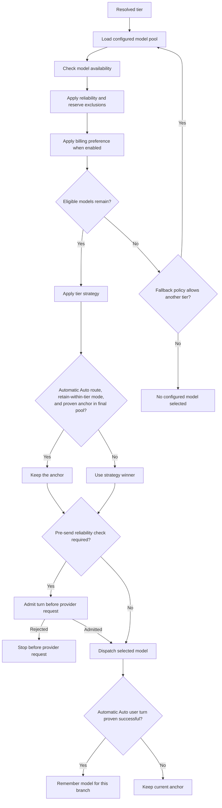
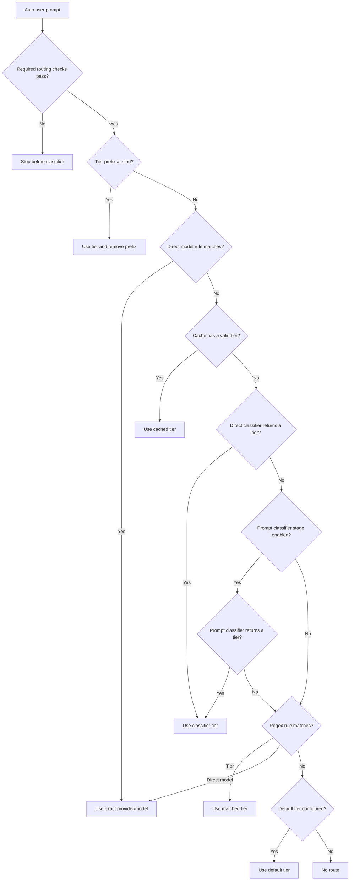
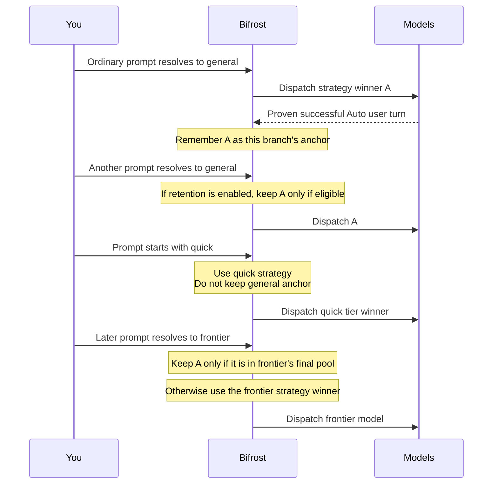
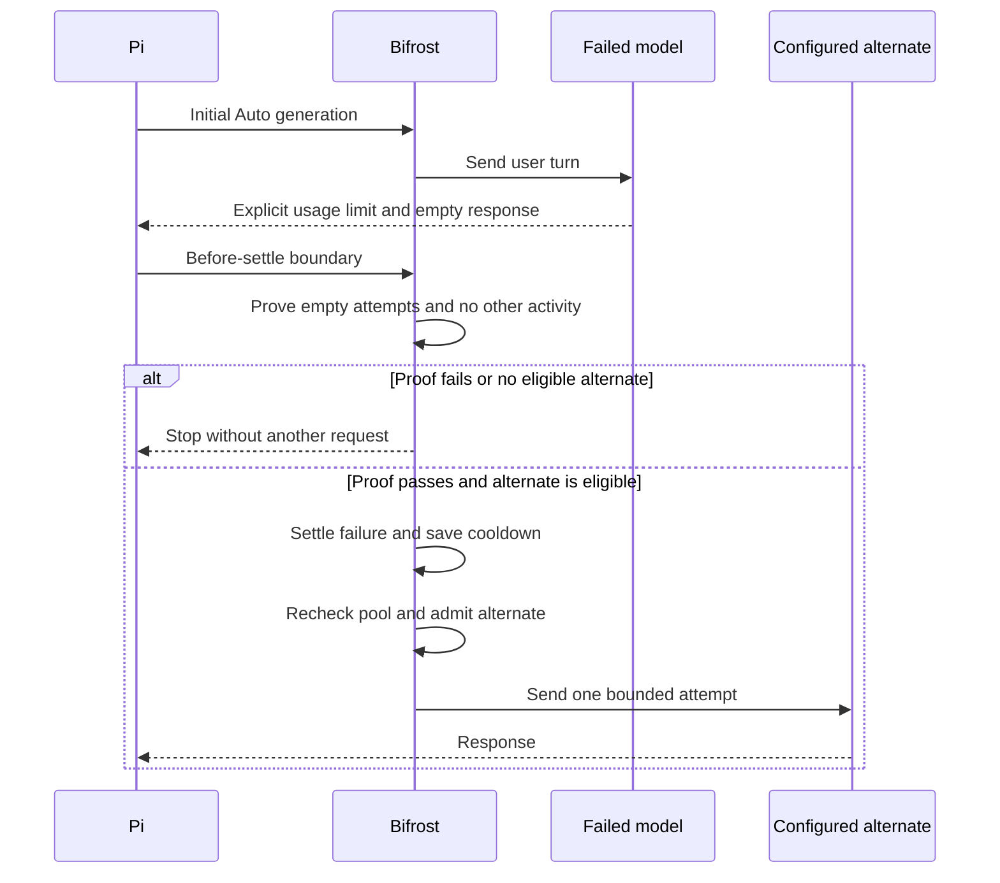

# Auto routing and model selection

[Guide index](index.md) · [Routing controls](routing-controls.md) · [Configuration](configuration.md)

Select `bifrost/auto` in Pi's `/model` picker to use Auto. Auto is opt-in. Physical model selection before generation remains the default. For each Auto request, Bifrost chooses a configured physical model and Pi sends the request to it.

Pi's footer shows the Auto selection and the physical model that handles the request. Assistant messages record the physical model. Tool continuations stay on the model that started the turn.

A tier is a named group of allowed models, such as `quick`, `general`, or `frontier`. A strategy is a rule that selects one model from a tier. A classifier is an optional model call that picks a configured tier. It does not select a physical model. A direct model binding selects one exact `provider/id` from a rule.

## Select and dispatch a model

Bifrost filters a tier's model pool before it selects a model. Availability checks, reliability circuits, and configured reserve rules can exclude candidates. A reliability circuit blocks a model after observed failures until a controlled recovery trial. A reserve rule can exclude a model based on configured allowance facts. A billing preference can narrow candidates by billing class when enabled. The configured strategy then selects a model.

Auto uses `retain-within-tier` by default. Bifrost keeps one model anchor for each branch. A proven successful automatic Auto user turn sets the anchor. Bifrost retains that model on a later automatic turn only when the current tier's final eligible pool contains it. Otherwise, Bifrost uses the strategy winner. Explicit tier prefixes, direct model bindings, retries, and tool continuations do not retain the anchor.

A fallback policy controls what happens when a tier has no eligible model. Legacy configuration can fall back to the configured default tier. Schema version 2 can set an ordered `tierPolicies.<tier>.fallbackTiers` list. An empty list makes that tier a boundary and stops fallback there. Version 2 alone keeps legacy fallback behavior. See [fallback boundaries](configuration.md#explicit-fallback-boundaries-schema-version-2).

An explicit fallback boundary, active provider pause, or configured `mode: "policy"` reserve admission prevents reuse of the last dispatched model. A reserve observation alone does not create a hard boundary. Without one of these guards, permissive fallback can warn and reuse the last dispatched model, including a model on an ordinary failure cooldown.

This selection diagram shows tier-based routing. A direct model binding skips tier selection and its strategy. Bifrost still applies normal model eligibility and reliability checks.

When the active reliability mode requires a pre-send check, Bifrost checks the turn before it sends the provider request. If the check rejects the turn, Bifrost stops before dispatch. Reliability state persists locally. A circuit blocks a model until its controlled recovery trial.

## Resolve a tier or model

Before classification, Bifrost completes required routing checks. If a check fails, it stops before the classifier. It then resolves a tier or direct model binding.

An explicit tier prefix takes precedence and chooses one tier for one turn. Bifrost removes the prefix before it sends the prompt. A direct model rule selects an exact `provider/id` and skips tier selection and its strategy.

For other prompts, Bifrost checks its local classification cache first. The cache maps normalized prompt terms to selected tiers. A cache hit skips classifier calls. On a miss, Bifrost tries a configured direct classifier, then a configured prompt classifier or prompt fallback, then remaining regex rules, then the default tier.

A direct model binding still uses normal model eligibility and reliability checks. Pinning a physical model stops automatic routing.

## Keep an eligible model within a tier

A proven successful automatic Auto user turn sets the branch anchor. Bifrost keeps one anchor per branch, not one per tier. Later automatic prompts can use that model only when it remains in the current tier's final eligible pool and retention is enabled. Otherwise, the tier strategy selects the model. The anchor never overrides availability, reliability, reserve, or billing-preference filters.

Set `affinity.mode` to `off` or `observe` when you want to change Auto retention. The [configuration guide](configuration.md#affinity-observation-and-retention) describes these modes. Physical routing keeps retention off by default.

## Recover from one empty allowance failure

Auto can make one attempt on a different configured model after an explicit usage or billing rejection. Text that clearly says a subscription is required or expired also counts as a billing rejection; a generic HTTP 403 does not. This recovery is enabled by default when reliability and allowance cooldown are enabled. Set `reliability.retryOnAllowanceExhausted` to `false` to turn off the retry. The provider pause still applies.

Pi must prove that every failed attempt from the original user turn was empty and came from the same model. Pi must record a null context edit for each earlier failure. This exact edit omits an empty reply from the next request and keeps it in the transcript. The turn must have no tool calls, tool results, queued messages, aborts, or intervening messages. The session, branch, configuration, and manual-control state must stay unchanged. Pi must finish its own bounded retry first. Unknown or unsafe turns stop without recovery.

Bifrost saves the applicable model or provider pause before it rechecks the configured pools. By default, usage and billing rejections pause all models with the same configured Pi provider ID. The setting `reliability.allowanceCooldownScope: "model"` limits those pauses to one model. Generic HTTP 429 rate limits remain provider-scoped. Bifrost does not identify shared billing accounts or fetch live usage limits.

Bifrost applies normal eligibility rules before it dispatches one alternate. An explicit tier prefix can recover only when the initial selection stayed in that tier, and its alternate must also come from that tier. If the initial selection fell back to another tier or the requested tier has no eligible alternate, recovery stops even when a general fallback is configured. Unprefixed Auto keeps its existing fallback behavior. Bifrost does not send the prompt through `sendUserMessage`, run a classifier or probe for recovery, or retry after output or activity. An active provider pause blocks every model with that provider ID, including a pinned model while Bifrost is on. See [provider pauses](reliability-and-cache.md#provider-pauses-are-not-account-checks).

Bifrost does not retry physical routes, direct model bindings, exhausted explicit fallback boundaries, tool continuations, or failures with output or activity. It makes at most one alternate attempt. A second billing denial or usage limit ends the turn. See [ADR 0023](../adr/0023-bounded-allowance-recovery.md) for the complete safety boundary.

## Related guides

[Routing controls](routing-controls.md) explains prefixes, pinning, and off/on controls. [Configuration](configuration.md) covers model pools, strategies, reserves, billing preferences, and fallback tiers. [Reliability and local cache](reliability-and-cache.md) explains persistent state and the migration steps for existing users. [Provider prompt caching](prompt-caching.md) explains model switching and cache reuse.
