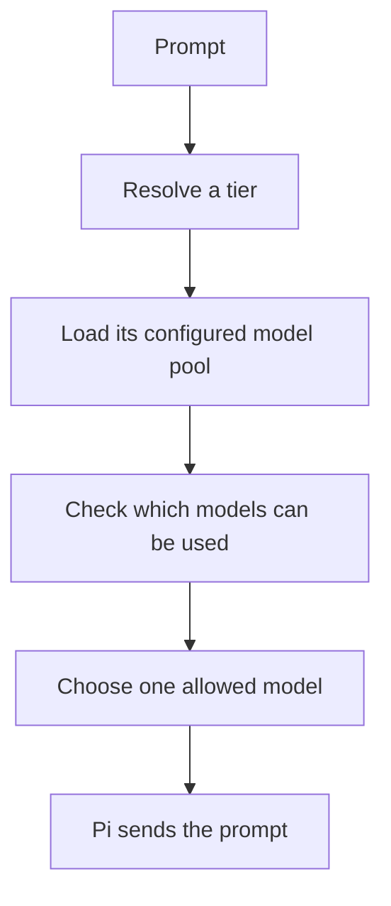

# Install and initialize Pi-Bifrost

[Guide index](index.md) · [Routing controls](routing-controls.md) · [Troubleshooting](troubleshooting.md)

## What Bifrost does

Pi-Bifrost chooses from models already available in [Pi](https://pi.dev). For each routed message it resolves a configured capability tier, filters unhealthy candidates, and applies your tier strategy. It activates Pi's actual provider/model before generation by default. Select `bifrost/auto` for opt-in per-request dispatch through Pi's virtual model API.

Bifrost does not provide model credentials or a model proxy.

## Before installing

You need:

- Pi `1.0.1` or newer;
- at least one model provider configured and authenticated in Pi;
- at least one model visible in Pi's model registry;
- network access for installation and provider requests.

Check Pi:

```bash
pi --version
```

Open Pi and confirm you can select and use at least one provider model before diagnosing Bifrost.

## Install

Install Bifrost from npm:

```bash
pi install npm:pi-bifrost
```

Restart Pi if the extension is not loaded in the current session.

## Understand four terms

- **Tier:** named capability group such as `quick`, `general`, or `frontier`.
- **Model pool:** provider/model IDs allowed in one tier.
- **Strategy:** rule that chooses one healthy model from a tier pool.
- **Classifier:** optional backend that judges the tier. It never chooses the exact provider model.

For a tier-based route, Bifrost follows these steps:



## Initialize

On a fresh install, routing is on and physical model selection is the default. Bifrost reads Pi's available chat-model catalog in the background when your first prompt arrives. It builds model pools in memory if no user configuration exists. It does not probe models or write a file.

You can send a first prompt without running init. A saved config or runtime preference can change the routing state; use `/bifrost debug` to check it. Selecting `bifrost/auto` in Pi's model picker is a separate opt-in. A user Bifrost config or project route file blocks automatic pool setup, even if the config contains only one setting.

To inspect the active pools and local status before sending a prompt, run `/bifrost inspect` or `/bifrost debug`. These commands do not classify or probe. Catalog availability does not confirm that a model is healthy.

Run this command when you want to refresh the model list or save it to a configuration file:

```text
/bifrost init
```

The command:

1. refreshes Pi's model catalog;
2. proposes `quick`, `general`, and `frontier` pools from available chat models;
3. detects a classifier backend and selects an available chat model when prompt classification needs one;
4. shows the catalog source, save target, membership changes, classifier choice, and uncategorized count, then asks once before it saves.

After saving, inspect the pools and status. Edit the saved configuration before your first generation if you need different pools or strategies, then run `/bifrost reload`.

Init updates the first existing destination in this order: project config `.pi/bifrost.json`, workspace config `bifrost.json`, then user config `~/.pi/agent/bifrost.json`. If none exists, it saves project config at `.pi/bifrost.json`. The displayed save target is the one init will update. Init preserves handwritten model entries and other configuration fields when it reconciles generated model memberships.

The command does not probe models by default. Pass `-f` to send probe requests. These requests can use provider credits or hit rate limits.

Bifrost does not ship maintainer-specific provider/model IDs as routing defaults.

### Probe usage warning

When you run `/bifrost init -f` or `/bifrost probe`, Bifrost sends `1+1=` to available chat models. The primary transport caps output at 5 tokens. An empty response can trigger one minimal-session fallback request. Default concurrency is 50 and per-model timeout is 10 seconds. Requests can incur provider usage, consume credits, or trigger burst rate limits.

Init does not probe models unless you pass `-f`. For tight provider limits, add probe settings to your existing config before running `/bifrost probe` or `/bifrost init -f`. If you are setting up Bifrost for the first time, run `/bifrost init` without `-f` and save the starter pools first. Then add probe settings before you probe.

Add this fragment to `~/.pi/agent/bifrost.json` (all projects) or `.pi/bifrost.json` (this project):

```json
{
  "probe": {
    "concurrency": 4,
    "timeoutMs": 10000
  }
}
```

Do not replace a complete Bifrost config with this fragment. A user config with only probe settings blocks automatic first-use pools.

See [Troubleshooting](troubleshooting.md#lower-probe-pressure) for symptoms and repair.

## Review the proposal

Before confirming, check:

1. The save target shown by init is the configuration you intend to update.
2. The membership-change summary and uncategorized count look reasonable.
3. The classifier choice matches your privacy and cost requirements.

The confirmation summary does not show every model ID, strategy, or default tier. After saving, run `/bifrost inspect` to review pools and status. Edit the saved configuration before your first generation if needed.

Classification is enabled by default. Init detects a classifier backend. When the prompt backend needs a model, Bifrost selects an available chat model as its default. On a local-cache miss, the active classifier can receive the current prompt. Run `/bifrost classifier off` to disable that extra call. Run `/bifrost classifier` to choose another backend or model. See [Classifier backends](classifiers.md).

For rules/default-only routing, disable the classifier. This command works without a Bifrost JSON config file:

```text
/bifrost classifier off
```

Or set this in your existing `.pi/bifrost.json`:

```json
{
  "classifier": {
    "enabled": false
  }
}
```

Setting `cache.enabled` to `false` disables classification-cache use, but does not remove saved entries. Run `/bifrost cache clear` to empty them. The selected generation provider still receives the prompt.

## Preview before generation

```text
/bifrost preview debug this race condition
```

Preview resolves and displays the source, tier, candidates, strategy, and selected model. It does **not** start a generation turn or activate the selected model.

Preview does run the normal tier pipeline. It does not read a tier name from the prompt, so a forced tier cannot be previewed. If a prompt, TypeSafe/Jev, or Pi-native classifier is enabled and no local cache entry resolves first, it can receive the preview prompt and incur classifier usage.

For local-only preview:

```text
/bifrost classifier off
/bifrost preview debug this race condition
```

Regex rules, configured default, and local classification cache still apply. Use `/bifrost cache clear` when testing rules/default without a prior cached tier.

## Send the first routed prompt

With routing on and nothing pinned, send an ordinary prompt. Bifrost picks a configured tier for that message, then a model from that tier's list, before generation.

Force one configured tier by putting its name first:

```text
quick commit the changes
```

Bifrost strips `quick` before the model receives the prompt. The tier's configured strategy still chooses the exact model.

Pin the active exact model for a long continuous session:

```text
/bifrost pin
```

Resume adaptive routing:

```text
/bifrost unpin
```

## Configuration locations

Config merges in this order; later layers win:

1. extension default: `<extensionDir>/bifrost.json`
2. user-global: `~/.pi/agent/bifrost.json`
3. project root: `bifrost.json`
4. project config: `.pi/bifrost.json`

Project-specific rules may also live in `bifrost-routes.json` or `.pi/bifrost-routes.json`; the `.pi` file wins.

After editing configuration:

```text
/bifrost reload
```

Use full `provider/id` values when ambiguity matters. Short patterns may substring-match more than one registry model.

## Next steps

- Learn adaptive, explicit-tier, and pinned behavior: [Routing controls](routing-controls.md).
- Edit pools, strategies, and rules: [Configuration](configuration.md).
- Understand N model switches and provider prompt caches: [Provider prompt caching](prompt-caching.md).
- Configure prompt, TypeSafe/Jev, or Pi-native classification: [Classifier backends](classifiers.md).
- Diagnose setup and routing failures: [Troubleshooting](troubleshooting.md).
